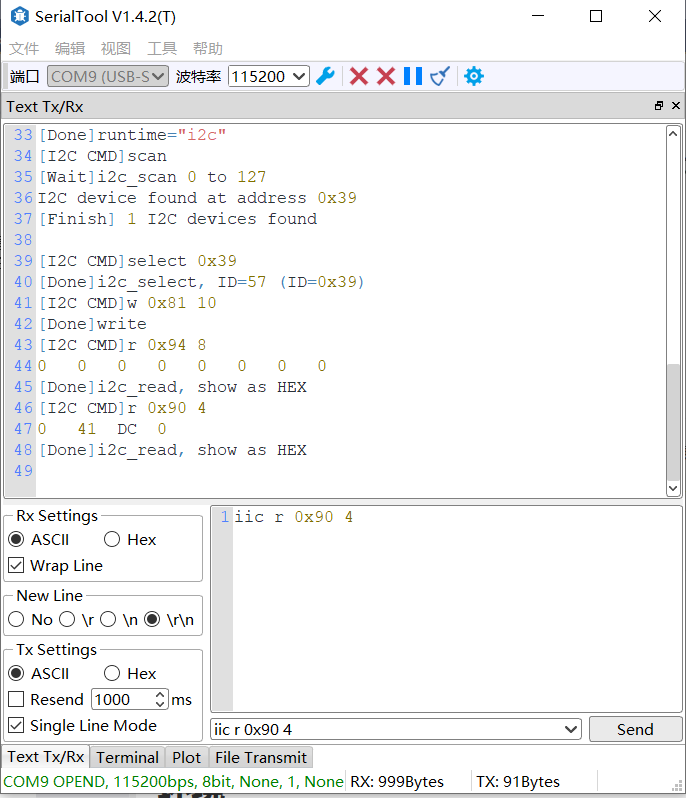

# ArduEx
意即Arduino-Extend，通过Arduino的IO资源扩展上位机的能力。  
此程序透过串口与Arduino开发板相连，上位机通过串口和命令行与Arduino交互。  
可以在不编译固件的前提下，低成本地对器件进行调试和检测，
甚至做生产环境的简易ATE。  

## 功能
- [x] i2c设备扫描、连接、读写
- [ ] i2s数据读写
- [ ] 由于我的Esp32S2只有WiFi没有蓝牙，不考虑蓝牙控制的功能。
- [ ] ...更多的点子欢迎讨论(虽然不见得能实现或者能测试)

## 使用方法
1. 保存[i2c_scaner.ino](https://github.com/tumuyan/ArduEx/blob/master/i2c_scaner/i2c_scaner.ino)
2. 使用Arduino IDE或者其他IDE编译并下载到你的Arduino开发板中
3. 打开任意串口工具，输入命令与Arduino开发板交互，从而控制Arduino IO读写数据。

## 命令列表
1. loop：循环运行上次运行的命令。输入q可以退出循环模式。
1. I2C（支持参数）：扫描、读写I2C设备
3. I2S（支持参数）：读写I2S设备
2. runtime: 查看当前的runtime
5. exit/quit
6. help：查看帮助
 
 ## 命令说明
1. 如输入命令时不带参数，进入该命令的runtime，后续可直接输入参数执行命令。输入exit或quit，退出runtime。
3. 即使在A命令的runtime中，也可以执行带参数的B命令，此时不退出A命令。
4. 命令支持的参数可以通过输入`命令 help`来查看，不再在文档中赘述。 
4. 每行命令以\n或\.作为结束符号。

## 测试环境
* ESP32-S2-SAOLA-1(已经快坏了)

## 运行截图
推荐一下我在用的串口工具 https://github.com/tumuyan/SerialTool 

